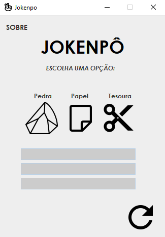
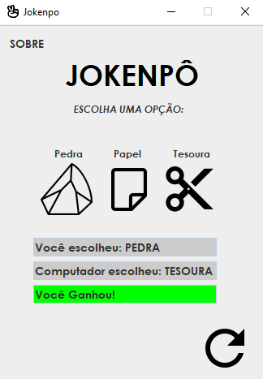
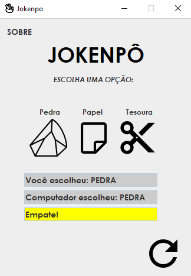
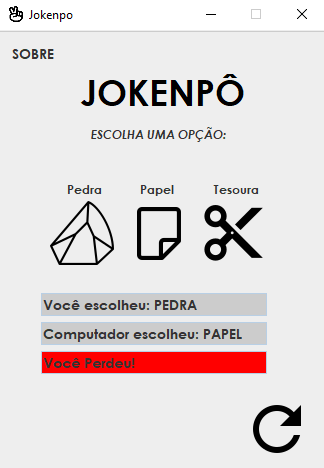

<h1 align="center">Jokenpô</h1>
<p>Esta é um aplicação desktop desenvolvida em Java, com o simples objetivo de implementar o popular jogo Jokenpô, que também é conhecido como: Pedra, Papel e Tesoura.</p>

## 🎮 Como Jogar

Baixe a versão compilada [aqui](dist/JOKENPO.jar?raw=true)

**Ou siga os passos a seguir:**
1. Clone este repositório para o seu computador usando:<br>
   ```git clone https://github.com/KarlosEKaminski/jokenpo.git```
3. Abra o projeto em sua IDE Java favorita.
4. Compile e execute o código.
5. Siga as instruções na interface gráfica para fazer sua escolha (Pedra, Papel ou Tesoura).
6. O computador fará uma escolha aleatória.
7. O resultado do jogo será exibido na tela.

## 📦 Recursos

- Diposnível apenas em PT-BR.
- Interface gráfica simples e intuitiva.
- Escolha aleatória do computador.
- Fácil de entender e jogar.

## ⚙ Requisitos
- JRE (Java Runtime Environment) 8 ou superior.
- JDK (Java Development Kit) instalado.
- IDE Java (Eclipse, IntelliJ IDEA, NetBeans) ou compilador Java.

## 📄 Licença

Este projeto está sob a licença MIT<br>
[](https://opensource.org/licenses/MIT)
<br>
<br>
<br>

## 📸 Screenshots
<div style="display: flex;">
   <p align="center">
      
      
      
      
   </p>
</div>
